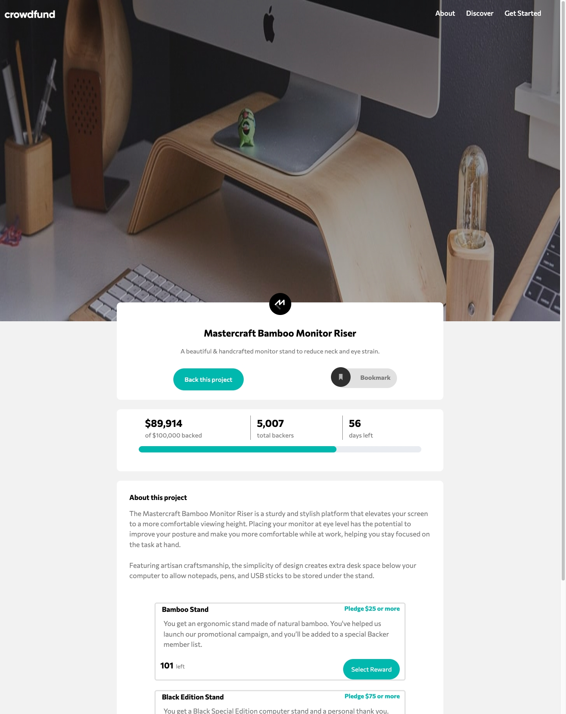
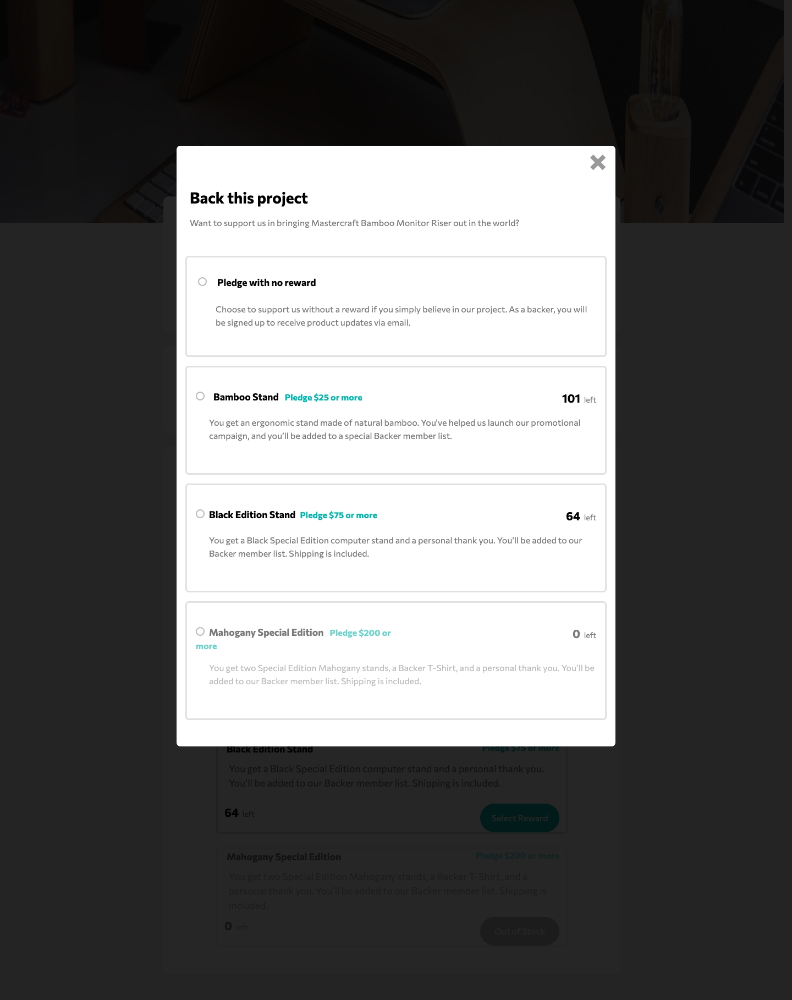
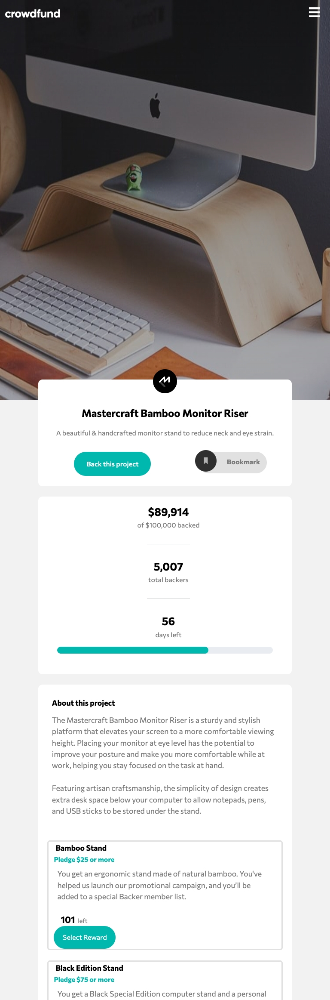
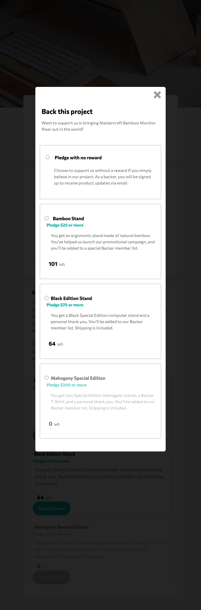
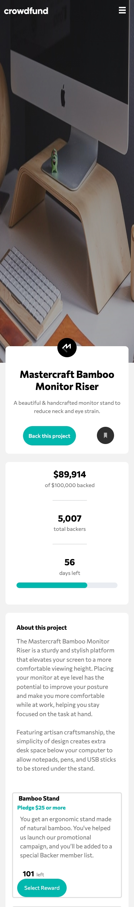
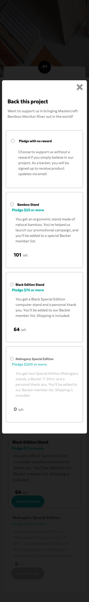

# Frontend Mentor - Crowdfunding product page solution

This is a solution to the [Crowdfunding product page challenge on Frontend Mentor](https://www.frontendmentor.io/challenges/crowdfunding-product-page-7uvcZe7ZR). Frontend Mentor challenges help you improve your coding skills by building realistic projects. 

## Table of contents

- [Overview](#overview)
  - [The challenge](#the-challenge)
  - [Screenshot](#screenshot)
  - [Links](#links)
- [My process](#my-process)
  - [Built with](#built-with)
  - [What I learned](#what-i-learned)
- [Author](#author)

**Note: Delete this note and update the table of contents based on what sections you keep.**

## Overview

### The challenge

Users should be able to:

- View the optimal layout depending on their device's screen size
- See hover states for interactive elements
- Make a selection of which pledge to make
- See an updated progress bar and total money raised based on their pledge total after confirming a pledge
- See the number of total backers increment by one after confirming a pledge
- Toggle whether or not the product is bookmarked

### Screenshot
- Desktop :

- Desktop2 : ;

- Ipad :

- Ipad2: ;

- Mobile :;

- Mobile2 : ;

### Links

- Solution URL: [Git Repo](https://github.com/codeAndcocoa/Crowdfunding-product-page.git)
- Live Site URL: [Add live site URL here](https://codeandcocoa.github.io/Crowdfunding-product-page/)

## My process

### Built with

- Semantic HTML5 markup
- CSS custom properties
- Flexbox
- CSS Grid
- Mobile-first workflow
- Bootstrap 5
- JavaScript

**Note: These are just examples. Delete this note and replace the list above with your own choices**

### What I learned

- I learned to use (.order-*) class in bootstrap to reorder columns in row depending on device's sizes.
- I learned to  use (.modal-lg) class to display larger modal.

## Author

- Website - [Github profile](https://github.com/codeAndcocoa)
- Frontend Mentor - [@codeAndcocoa](https://www.frontendmentor.io/profile/codeAndcocoa)

**Note: Delete this note and add/remove/edit lines above based on what links you'd like to share.**

